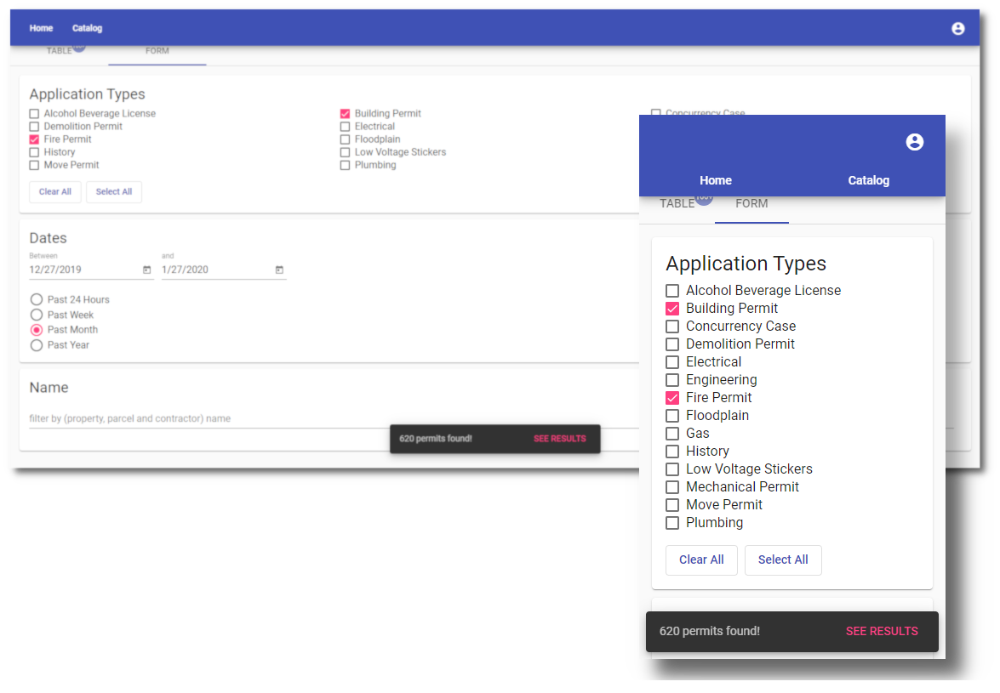

# OrlData

An Angular app that syndicates to ['Orlando's Open Data'](https://data.cityoforlando.net/) services to view public records. This project has been developed and continues to be served, with at least the following:

- Front-end tech includes: [Angular](https://angular.io/) 8.0 with [NgRx](https://ngrx.io/) for state management, and also [Angular Material](https://material.angular.io/) for UI components.
- Cloud computing is Azure which consists of the following SaaS: [Azure AD B2C](https://docs.microsoft.com/en-us/azure/active-directory-b2c/active-directory-b2c-overview) for authentication using [msal-angular](https://github.com/AzureAD/microsoft-authentication-library-for-js); [ContainerRegistry](https://docs.microsoft.com/en-us/azure/container-registry/container-registry-intro) for the application's Docker image; [KeyVault](https://docs.microsoft.com/en-us/azure/key-vault/key-vault-overview) for application credentials; and [App Service](https://docs.microsoft.com/en-us/azure/app-service/containers/app-service-linux-intro) to host Docker image.
- Authentication at this time are OpenID identity providers for [GitHub](https://developer.github.com/) and [LinkedIn](https://www.linkedin.com/developers/). In addition, email is also accepted as a form of identity.
- Docker image consists of: [Alpine](https://hub.docker.com/_/alpine/) for Linux OS; [NGINX](https://www.nginx.com/) for web server; and [Docker-compose](https://docs.docker.com/compose/) to build image.
- Deployments are automated by utilizing PowerShell [Az](https://docs.microsoft.com/en-us/powershell/azure) module and [az](https://docs.microsoft.com/en-us/cli/azure) executable. These 2 programs are executed in PowerShell to deploy an [ARM template](https://docs.microsoft.com/en-us/azure/azure-resource-manager/templates/overview) when needed.
- The underlying API service is provided by [Socrata](https://dev.socrata.com/) where OData query expressions are formed within the app.
- Image below was composed in [GIMP](https://www.gimp.org/).

The UI layout is derived from Angular Material's website, whereas my objective for the UI was to simply utilize Material components by styling and programming them.

Visit the following link to see 'OrlData':
[orldata.azurewebsites.net](https://orldata.azurewebsites.net)

## Other README

For information on how to use this repository in regards to development and deployment, see the following README file:

- ['.\build\'](build/README.md)
