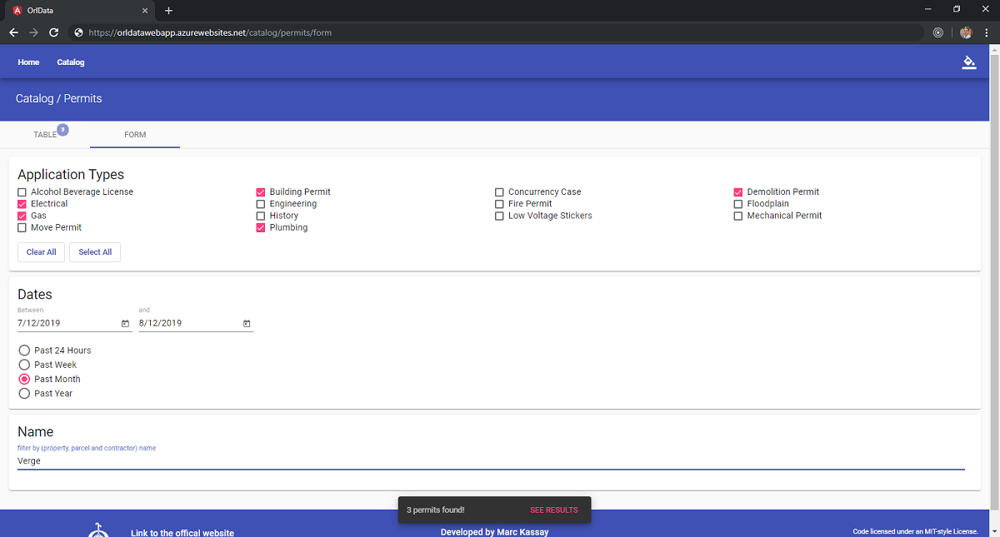

# OrlData

An Angular app that syndicates to ['Orlando's Open Data'](https://data.cityoforlando.net/) services. This application has been developed using [Angular](https://angular.io/) 8.0 with [NgRx](https://ngrx.io/) for state management, and also [Angular Material](https://material.angular.io/) for UI components.

The UI layout is derived from Angular Material's website, whereas my objective for the UI was to simply utilize Material components by styling and programming them. The services are provided by [Socrata](https://dev.socrata.com/)'s DaaS platform using their "rich query functionality" through a query language that they refer to as "Socrata Query Language" or "SoQL".

Development environment contains a Docker image that is able to hot-reload the browser. This is particularly helpful when simultaneously debugging on an attached Android phone, thanks to the robust Chrome browser. Production image is pushed to an Azure Container Registry for containerization by Azure App Service which is where the app is being hosted. PowerShell has been used to supplement automating CLI expressions with Azure ARM templates.

Visit the following link to see 'OrlData':
[orldatawebapp.azurewebsites.net](https://orldatawebapp.azurewebsites.net)

## Other READMEs

- ['.\tools\'](tools\README.md)

- ['.\build\'](build\README.md)
